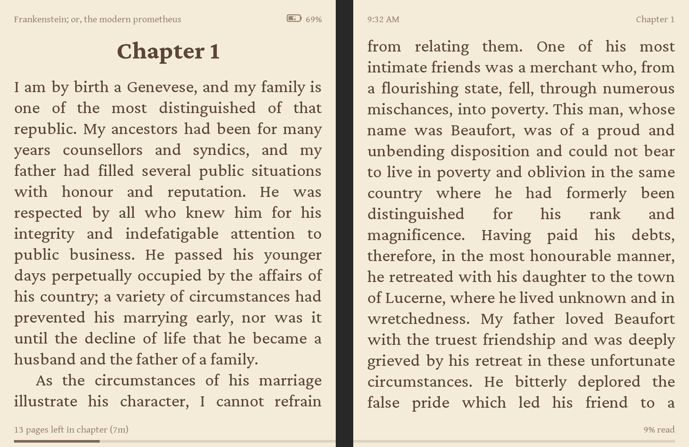
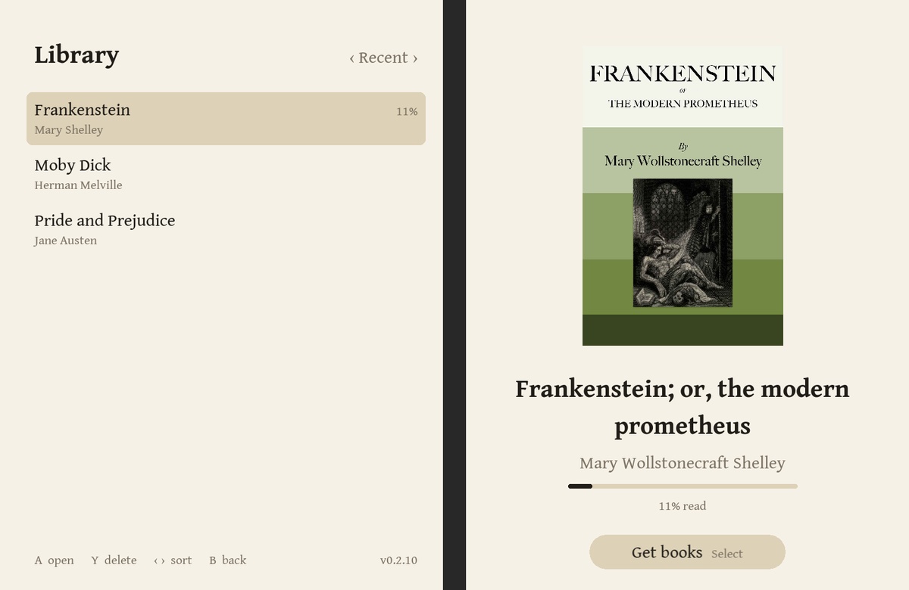
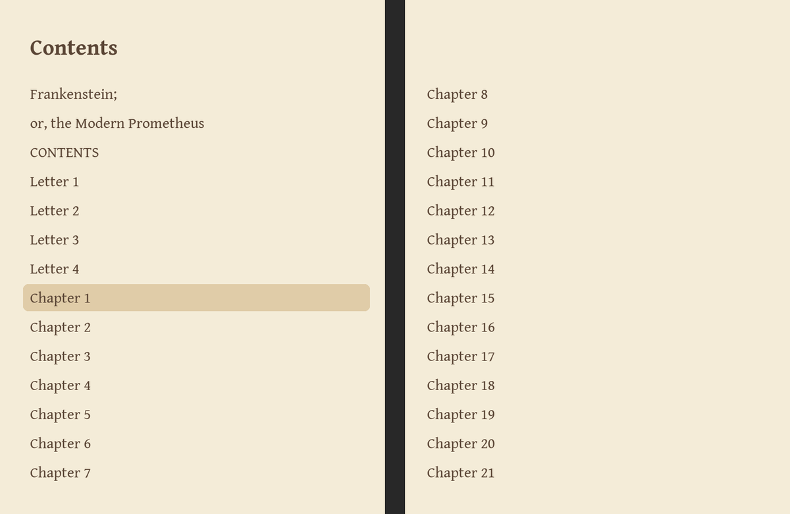
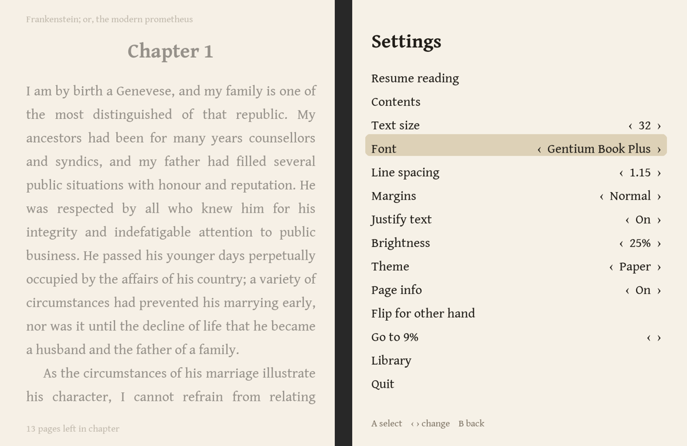
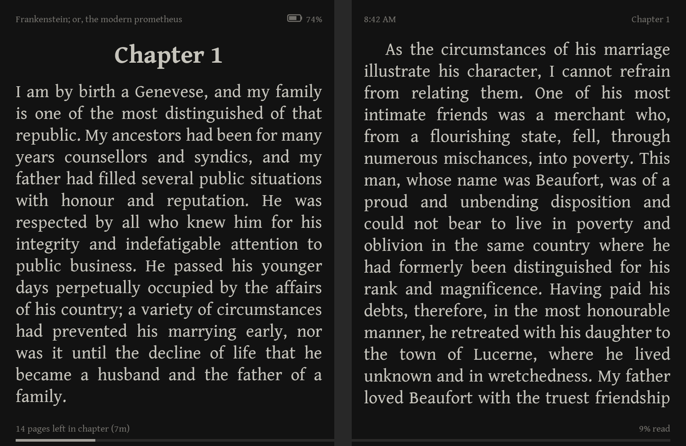

# eReaderDS for the RG DS Plus

Hey guys, I'm casualducko. I've been coding since the late 90's and I absolutely
love it. I like to think that I know my stuff, but I don't know everything. With
that being said, I have gladly been using Claude Code to help me bring this idea
to its full potential.

eReaderDS is a two-page ebook reader for the **Anbernic RG DS Plus**. Hold the
device sideways like an open book: each screen shows one page.



> For the **RG DS Plus on its stock firmware or ROCKNIX** (not the original RG
> DS, and not other custom firmware such as KNULLI). Found a problem? Please
> [report it](#reporting-problems).

## Install

Download `eReaderDS-vX.Y.Z.zip` from the
[latest release](https://github.com/casualducko/eReaderDS/releases/latest)
and unzip it on your computer. Then follow the steps for
your firmware.

### Stock firmware

1. Put the SD card in your computer. From the unzipped `Ports` folder, copy
   **`eReaderDS.sh`** and the **`eReaderDS`** folder into the `Ports` folder on
   the card, and `Imgs/eReaderDS.png` (the menu icon) into `Ports/Imgs`.
2. Put `.epub` or `.txt` books in the card's `Ebook` folder. Folders inside it
   are fine: you can copy a whole Calibre library, or keep your own folders.
3. On the device, open **Ports → eReaderDS**.

### ROCKNIX

On ROCKNIX, copy the files **over Wi-Fi**, not with the SD card in your
computer. The card has two parts: a small `ROCKNIX` one (the system) that Mac
and Windows can open, and a larger Linux one with `roms` (games, ports and
books) that they **can't**. If your computer says the card is unreadable and
offers to initialize or format it, choose **Ignore**: formatting would erase
it.

1. Put the card in the device, start ROCKNIX and turn on Wi-Fi. Its address is
   in **Start → Network settings** (for example `192.168.1.50`).
2. On your computer, open the device's shared folders:
   - **Mac:** Finder → **Go → Connect to Server…** (⌘K), type
     `smb://192.168.1.50` (the device's address), and connect as a guest.
   - **Windows:** in File Explorer's address bar, type `\\192.168.1.50`.
3. Open the **games-roms** share (that's `roms`). From the unzipped `Ports`
   folder, copy **`eReaderDS.sh`** and the **`eReaderDS`** folder into its
   **`ports`** folder. (`Imgs` isn't needed; eReaderDS adds its own menu icon.)
4. Put books in the share's **`ebook`** folder (fonts in `ebook/Fonts`). It's
   created the first time eReaderDS runs, if it isn't there yet.
5. On the device, press **Start → Game settings → Update gamelists**, then open
   **Ports → eReaderDS**.

While it runs, the bottom screen is turned on; closing the lid is handled by
ROCKNIX.

**Updates:** when it's online, eReaderDS checks for a newer version each time
it starts and says so (with the version you have). Tap that note to update, or
use **Settings → About eReaderDS** (or **Start** in the library with no book
open). The update screen lists what's new in plain words; **Update now**
downloads it, saves only the files that changed, and restarts. Your books,
settings and progress are kept. After an update, a note offers to show
**What's New** (also in Settings → About eReaderDS).

To stop the automatic check and its notes, set **Update notices** to Off (same
page); **Check for Updates** still works. To pass on just one version, choose
**Skip this version** on the update screen; you'll still hear about the next.

To update by hand, copy the same two items from a newer zip over the old ones
(on ROCKNIX, over Wi-Fi into `games-roms/ports`, as above). Your settings,
reading positions, bookmarks and fonts are kept. (Copy the two items, not the
whole `Ports` folder: on a Mac, replacing `Ports` deletes your other ports.)

## Controls

Hold the device turned counter-clockwise, buttons under your right hand.
Directions are as you hold it.

| Button | While reading | In lists and menus |
|---|---|---|
| D-pad or stick | Turn pages (right/down forward) | Up/down move; left/right change a value, page through a list, or change the library's sort order |
| A | Show the notes on these pages | Select |
| B | Settings | Back |
| Y | Look up (or highlight) a word | In My Books: options (mark finished, hide finished books, delete); in Bookmarks and Highlights: delete |
| Select | Bookmark the page (again to remove) | Close; in the library: Get Books |
| Start, X, ↩, or pressing the stick in | Settings | Open or close Settings (the stick selects) |
| Menu (Anbernic button) | Quit | Quit |

The L/R and L2/R2 shoulder buttons aren't used. **Help** in Settings is a
one-page summary of the buttons and touchscreen.

**Touch (bottom screen only):**
- Swipe left/right, or tap the right/left half, to turn pages. (To make a tap
  open Settings instead: **Settings → Reading & Device → Tap**.)
- Slide up/down to change brightness; keep going below 1% for Extra dim. (On
  a list, such as My Books, Get Books, Table of Contents or Fonts, sliding
  up/down scrolls it instead.)
- Pinch with two fingers to make the text bigger or smaller.
- Tap the top-right corner to bookmark the page.
- Tap the top edge (left of that corner) to show or hide all the status bars.
- Press and hold a word to look it up.
- While highlighting (**Y**, then **Select**), tap a word to extend the
  highlight to it.
- In the library and Get Books, tap an entry to see it on the other screen,
  and tap it again to open (or download) it. The same goes for Table of
  Contents (the other screen shows where that chapter is in the book),
  Bookmarks and Highlights (the whole passage) and Find in Book (the whole
  paragraph around the match).
- Swipe (or tap) to turn the pages of What's New.
- Tap a note number, or the **Notes** button, to show footnotes.

## Settings

Press **B** (or Start, X, ↩) while reading. Settings has big rows on two
pages: swipe left or right on the touchscreen, or keep pressing down past the
last row. Tap **‹** or **›** to change a value, or use the D-pad.

1. **Table of Contents, Bookmarks and Highlights, Find in Book, Jump to %,
   My Books** (your library); **Fonts** (its own page, [below](#fonts)),
   **Text size**, **Theme**, **Brightness**; **Help**. (**Update to v…** is at
   the top when one is waiting.)
2. **Line spacing, Justify text, Hyphenation, Margins, Top/bottom margins**;
   **Night Theme** ([below](#night-theme)); **Status Bar ›** (what the top
   and bottom lines show, and the clock style), **Reading & Device ›**
   (page-turn animation, what a tap does, dictionary, screens off after a
   while, closing the lid, time zone), **KOReader Sync ›**
   ([below](#koreader-sync)), **About eReaderDS ›** (What's New, Check for
   Updates, Update notices, Report a Problem, About & Credits); **Quit**.

## Features

- **Reading:** EPUB and plain text with italics, headings, images and covers;
  justified text with optional hyphenation (English); 18 built-in fonts plus
  your own; 11 themes (Sepia by default, plus E-ink, Paper, Midnight, Amber
  and more) that the whole app follows, and a night theme that switches on by
  itself in the evening; page-flip or fade animation.
- **Footnotes on the facing page:** press A and the note appears on the other
  page while the text stays put.
- **Dictionary on the facing page:** press Y and move a cursor over the words;
  English is built in, and you can add your own ([below](#dictionaries)).
- **Highlights:** mark passages and find them again in the list of bookmarks
  and highlights ([below](#highlights)); they're also saved as a file for each
  book, to read on a computer.
- **Get books over Wi-Fi:** Project Gutenberg and Standard Ebooks built in,
  plus Calibre or any OPDS catalog ([below](#getting-books-over-wi-fi)); or
  send your own books from a phone or computer's web browser
  ([below](#sending-books-from-a-phone-or-computer)).
- **My Books** (the library): every book in the `Ebook` folder and the folders
  inside it (a copied Calibre library works as it is), listed by the title and
  author inside each book (not the file name); covers and progress, sorted by
  recent, title, author (by last name), series (each series in order, "Book 2",
  from the series Calibre and other EPUBs record) or progress (grouped under
  Reading, Not Started and Finished); each shows "Reading · 16%" or
  "Finished ✓". A book is marked finished when you reach its last page (or by
  hand: **Y** in My Books, which can also hide finished books, or delete a
  book).
- **KOReader Sync:** carry your place between eReaderDS and KOReader or
  CrossPoint (a phone, Kobo, Kindle, Xteink X4...) ([below](#koreader-sync)).
- **Finding your place:** bookmarks and highlights, Table of Contents, Jump to %, **Find in Book**
  (type a word or phrase on the touchscreen keyboard; every match is listed,
  and the words are marked on the page you open). Your place in every book is
  saved.
- **Status bar:** book and chapter titles, pages left, time left in the chapter
  (learned from your reading speed), percent read, a progress bar, battery and a clock.
  Choose what shows in **Settings → Status Bar**. The clock follows the
  device's time; if it's off, pick your zone in **Settings → Reading &
  Device → Time zone**.
- **Battery-friendly:** the screen only redraws when something changes,
  closing the lid puts the device to sleep, and left alone for 10 minutes the
  screens dim, then turn off (any button or touch brings them back; change the
  time or turn it off in **Settings → Reading & Device → Screens off after**).

| Library | Contents |
|---|---|
|  |  |

| Settings | Midnight theme |
|---|---|
|  |  |

*Screenshots use public-domain books from Project Gutenberg.*

## Night Theme

**Settings → Night Theme** picks a second theme (Midnight, Amber and Dusk
are the darker ones) and the hours to use it, 9 PM to 7 AM to start. It
switches on the hour by the device's clock, and the whole app changes with
it. While picking, the touchscreen previews each theme. At night, the
**Theme** row changes the night theme (it says "(night)"), so your daytime
theme is left alone.

## Sending books from a phone or computer

In the library press **Select** (or tap **Get Books**) and choose **Send from
Your Phone or Computer**. The screens show an address (such as
`192.168.1.50:2045`) and a QR code. On a phone or computer on the same Wi-Fi,
scan the code or type the address into a web browser, then tap **Choose
files** (or drop files on the page). Books (`.epub`, `.txt`) go into the
books folder and fonts (`.ttf`, `.otf`) into the fonts folder; each is listed
on the device as it arrives. Press **B** or tap **Done** when they're sent:
the new books are in My Books. The page only works while this screen is open.
This is the easy way to add books on ROCKNIX.

## Getting books over Wi-Fi

Turn on Wi-Fi in the device's settings, then in the library press **Select**
(or tap **Get Books** on the touchscreen) and choose a catalog. Browse with
the D-pad or by tapping, and press A on a book to download it to the `Ebook`
folder. Books you already have are marked ✓. Without Wi-Fi the button is
greyed out. **Search** (at the top of a catalog, when it supports searching,
as Gutenberg and Calibre do) opens an on-screen keyboard on the touchscreen:
tap the keys, or use the D-pad and A.

**Project Gutenberg** (70,000+ free books) and **Standard Ebooks** (classics,
carefully proofread and beautifully typeset: the whole collection, by newest,
subject, collection or author, and search) work with no setup. To add your
own catalog, such as a Calibre content server or Calibre-Web, edit
`Ebook/.ereaderds/opds.txt` on the SD card (it's created the first time
eReaderDS runs):

```
name = Calibre
url = http://192.168.1.20:8080/opds
user = me
password = secret
```

Leave out `user` and `password` if the server doesn't need them, and add a
block for each extra catalog. Add `verify = no` for a server with a
self-signed certificate. To hide a built-in catalog, add `gutenberg = off` or
`standardebooks = off`.

## Highlights

Press **Y** for the word cursor, move to the first word, press **Select**, move
to the last word (the highlight grows as you go, across both pages), and press
**Select** again. **B** cancels. To remove one, put the cursor on it and press
**Select**. Highlights show as a band behind the words in every theme, stay
put when you change the font or text size, and are listed with your bookmarks
in **Settings → Bookmarks and Highlights** (A goes there; Y deletes one after you
confirm; left/right, or a tap on the label at the top, shows All, just
Highlights or just Bookmarks).

Your highlights and bookmarks are also saved as a file for each book, to read
or copy on a computer (like a Kindle's "My Clippings"):
`Ebook/Highlights/Title - Author.md`, in reading order under each chapter.
It's written again whenever they change, so add your own notes elsewhere.

## KOReader Sync

If you also read in **KOReader** or **CrossPoint** (on a phone, Kobo, Kindle,
PocketBook, or an Xteink X4), eReaderDS can share your place in a book with
it through a KOReader sync server, so each picks up where the other left off.

1. **Settings → KOReader Sync → Server:** the same server as your other
   device. **CrossPoint** (`sync.crosspointreader.com`, CrossPoint's default
   and ours), **KOReader** (`sync.koreader.rocks`, KOReader's default), or
   **Your own** (press A to type its address, such as
   `http://192.168.1.20:7200`: Kavita, Komga, Calibre-Web, BookLore and others
   can be sync servers).
2. **Account:** the same user name and password as on the other device (a new
   name makes a new account).
3. Read. When you open a book, eReaderDS checks the server; if another device
   has been reading it since, it asks **Continue from 45%?** (Jump or Stay).
   It sends your place when you leave the book, close the lid, or the screens
   go off, and every few minutes while reading (checking first that no other
   device has moved on meanwhile).

**Sync this book now** (Settings → KOReader Sync) works out which way to go,
like CrossPoint's smart sync: if you've read on here since the last sync, it
sends your place; if only the other device has read on, it goes there; if
both have, it asks. It never sends an older place over a newer one without
asking.

Places are matched to the paragraph (you may land a page or so from where the
other device was, since screens differ). EPUB books only.

**The same book on both devices:** **Match books by** must be the same on
both. Choosing CrossPoint's server sets **File name** (CrossPoint's default:
give the files the same name on both), KOReader's sets **File contents**
(KOReader's default: both need the same file; Calibre can change a book when
it sends it to a device). **Send book details** (off by default) adds the
book's title, author and file name to what's sent, as KOReader and CrossPoint
can. If a server is down, eReaderDS simply tries again later.

## Dictionaries

While reading, press **Y**: a cursor appears on a word. Left/right move it
word by word and up/down line by line, across both pages, and the definition
shows on the facing page (A for more of a long entry, B to close).

English (WordNet) is built in. To add others, copy **StarDict** dictionaries
(the files KOReader uses: `.ifo`, `.idx`, `.dict` or `.dict.dz`, and `.syn`
if there is one) into `Ebook/Dictionaries`. By default every dictionary with
the word is shown, yours first; pick a single one in
**Settings → Reading & Device → Dictionary**.

## Fonts

**Settings → Fonts** opens a two-page view: the fonts on the touchscreen, each
named in its own typeface, and a sample page in the highlighted one on the
other screen. The list is alphabetical; left/right (or tapping **All · Serif ·
Sans** at the top) narrow it. Up/down pick a font, A uses it.

**Built in:** Crimson Pro (default), Gentium Book Plus, Literata, Charis SIL, Source Serif
4, Crimson Text, EB Garamond, Lora, Merriweather, PT Serif, Spectral,
Vollkorn, Bitter, Atkinson Hyperlegible Next, Inter, Lexend, Andika and
OpenDyslexic.

**Get More Fonts:** the **Get More Fonts** button beside the title of the font page (or Y) downloads more over Wi-Fi:
Alegreya, Cardo, Gelasio, IBM Plex Serif, Libre Baskerville,
Newsreader, Noticia Text, Zilla Slab, Alegreya Sans, Fira Sans, IBM Plex Sans,
Lato and Source Sans 3 (free, SIL Open Font License, from Google Fonts; about
200 KB–1.4 MB each). Each is shown in its own typeface; A downloads it into the
fonts folder, then A reads in it and Y deletes it. The list lives in this
repository's `fontpack` folder (built by `tools/build-font-pack.py`).

**Your own:** copy `.ttf` or `.otf` files into `Ebook/Fonts`, then choose
them in **Settings → Fonts**. Regular, italic and bold files of a family are
grouped automatically. Use static fonts: a variable font (`[wght]` in the
name) only shows one weight.

## Troubleshooting

| Problem | Try this |
|---|---|
| Not in the Ports menu | `eReaderDS.sh` and the `eReaderDS` folder must be directly inside `Ports` (ROCKNIX: `roms/ports`, then **Start → Game settings → Update gamelists**). |
| ROCKNIX: can't find `roms` on the SD card | It's on the card's Linux part, which Mac and Windows can't open. Copy over Wi-Fi instead ([ROCKNIX](#rocknix)); never let the computer format the card. |
| Black screen, or it closes at once | Send `Ports/eReaderDS/log.txt` with a [report](#reporting-problems). |
| "No books found" | Put `.epub` or `.txt` files in the `Ebook` folder at the top of the card (or in folders inside it). |
| A book won't open or looks wrong | Unusual EPUBs may not display well; DRM-protected books, PDF and MOBI aren't supported. |
| Get Books is greyed out | Turn on Wi-Fi in the device's settings and wait for it to connect. |
| Pages upside down | Turn the device the other way, with the buttons on your right. |
| Screen stays dim after quitting | Brightness is restored when the app quits; after a crash, set it in the system menu. |
| The clock is wrong | Set **Settings → Reading & Device → Time zone** (**Device clock** uses the system's own setting). |
| An update fails | Check Wi-Fi and choose **Try again**. Nothing is changed until an update is complete; you can also [update by hand](#install). |

## Reporting problems

If eReaderDS runs into a problem it says so, keeps your place in the book, and
quits when you press a button. The next time you open it, a note offers to
report it: tap it for a QR code that opens a bug report on your phone with the
version and what went wrong filled in (no book titles). Nothing is sent from
the device; you read the report and send it yourself. **Settings → About
eReaderDS → Report a Problem** shows the same code any time.

Or tell whoever sent you eReaderDS, or
[open a bug report](https://github.com/casualducko/eReaderDS/issues/new?template=bug_report.yml).
Include the **version** (top of Settings), **what happened** (a photo of the
screens helps), and **`Ports/eReaderDS/log.txt`**, copied right after the
problem.

## Known limitations

- Touch works only on the bottom screen.
- When a chapter runs over several files in the EPUB, its pages in files not
  opened yet are estimated (usually within a few pages) until you reach them.
- No tables, fixed-layout EPUBs, PDF, MOBI or DRM-protected books.
- Hyphenation and the built-in dictionary are English only.

## For developers

See [docs/DEVELOPING.md](docs/DEVELOPING.md).

## License

eReaderDS is open source under the [MIT License](LICENSE). The fonts,
dictionary, hyphenation patterns, QR code library and engine it includes keep
their own licenses (below, and in the download's `LICENSES` folder).

## Credits

eReaderDS is created by **casualducko** (also in **Settings → About eReaderDS →
About & Credits**).

- **Fonts**, all under the SIL Open Font License 1.1 (license files in
  `app/fonts/` and the download's `LICENSES` folder):
  [Gentium Book Plus](https://software.sil.org/gentium/),
  [Charis SIL](https://software.sil.org/charis/) and
  [Andika](https://software.sil.org/andika/) (SIL International),
  [Literata](https://github.com/googlefonts/literata) (TypeTogether),
  [Source Serif 4](https://github.com/adobe-fonts/source-serif) (Adobe),
  [Crimson Pro](https://github.com/Fonthausen/CrimsonPro) (Jacques Le Bailly),
  [Crimson Text](https://github.com/googlefonts/Crimson) (Sebastian Kosch),
  [EB Garamond](https://github.com/octaviopardo/EBGaramond12) (Georg Duffner,
  Octavio Pardo), [Lora](https://github.com/cyrealtype/Lora-Cyrillic) (Cyreal),
  [Merriweather](https://github.com/SorkinType/Merriweather) (Sorkin Type),
  [PT Serif](https://fonts.google.com/specimen/PT+Serif) (ParaType),
  [Spectral](https://github.com/productiontype/Spectral) (Production Type),
  [Vollkorn](http://vollkorn-typeface.com) (Friedrich Althausen),
  [Bitter](https://github.com/solmatas/BitterPro) (Huerta Tipográfica),
  [Atkinson Hyperlegible Next](https://github.com/googlefonts/atkinson-hyperlegible-next)
  (Braille Institute), [Inter](https://github.com/rsms/inter) (Rasmus Andersson),
  [Lexend](https://github.com/googlefonts/lexend) (Lexend Project) and
  [OpenDyslexic](https://github.com/antijingoist/opendyslexic) (Abbie Gonzalez).
  Crimson Pro, Bitter, Atkinson Hyperlegible Next, EB Garamond, Lora,
  Merriweather and Vollkorn are static instances generated from their
  variable fonts (`tools/build-fonts.py` for Crimson Pro and the last four).
- **Hyphenation:** US English patterns from TeX's
  [hyph-utf8](https://www.hyphenation.org/tex), © Gerard D.C. Kuiken (notice
  in `app/hyph/en-us.txt`).
- **Dictionary:** [WordNet](https://wordnet.princeton.edu) 3.1, © 2011
  Princeton University, under the WordNet license
  (`app/dict/WordNet-LICENSE.txt`); converted by `tools/build-wordnet.py`.
- **QR codes:** [qrencode.lua](https://github.com/speedata/luaqrcode) by
  Patrick Gundlach and contributors (BSD license, in `app/qrencode.lua`).
- **Engine:** [LÖVE](https://love2d.org) 11.5 (zlib license), from the
  PortMaster aarch64 runtime. See [runtime/NOTICES.md](runtime/NOTICES.md).
