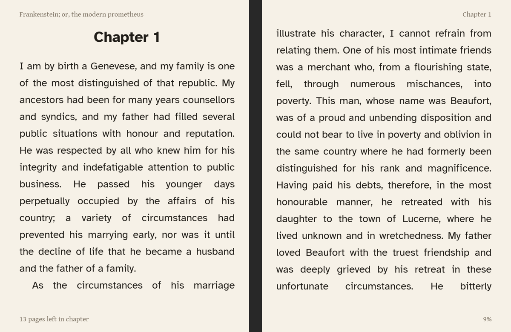
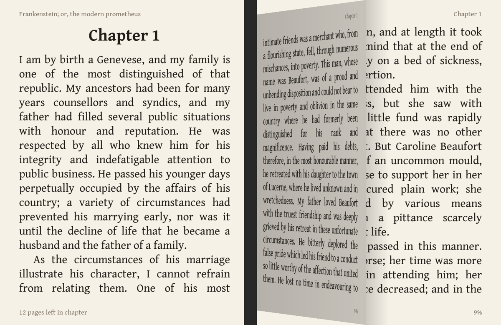

# RG DS Plus Book Reader

A two-page ebook reader for the **Anbernic RG DS Plus**. Hold the device
sideways like an open book and each screen shows one portrait page.


## Features

- **Two-page spreads** across both screens, rotated for sideways reading, with
  a setting to flip for either hand
- **EPUB and plain text**: italics, bold, headings, images, covers and the
  book's table of contents
- **Book-style layout**: justified text, paragraph indents, and each chapter
  starts on a new page
- **Library** with cover previews and per-book progress
- **Page-turn animation**: a 3D page flip across the hinge, or a fade, or off
- **Touch**: tap to open settings and tap its rows; slide up or down for
  brightness, like a Kobo
- **Remembers your place** in every book and reopens the last one on launch
- **Fonts**: three bundled (Gentium Book Plus, Crimson Text, Atkinson
  Hyperlegible), plus any `.ttf`/`.otf` you add yourself
- **Settings**: text size, font, line spacing, margins, justification, brightness,
  page turn, what a tap does,
  four themes (Paper, White, Sepia, Night), page info on/off, and jump to %
- **Battery-friendly**: redraws only when you press a button

| Library | Contents |
|---|---|
|  |  |

| Settings | Night theme |
|---|---|
|  |  |

*Screenshots use public-domain books from Project Gutenberg.*

## Install

1. Put the SD card in your computer. It should mount as `ROMS`.
2. Run:
   ```sh
   ./install.sh                 # defaults to /Volumes/ROMS
   ./install.sh /path/to/card   # any other mount point
   ```
3. Copy `.epub` or `.txt` files into the `Ebook` folder on the card.
4. On the device, open **Ports → Book Reader**.

The installer copies the app to `Ports/BookReader/` and adds
`Ports/Book Reader.sh` to the Ports menu. Running it again updates the app
and keeps your settings and reading progress.

### LÖVE runtime

The reader runs on [LÖVE](https://love2d.org) 11.5 (aarch64). Those binaries
aren't stored in this repo. On a first install, `install.sh` copies them from
another port on the card that bundles them (for example a PortMaster LÖVE
port with `runtime/love.aarch64` and `runtime/libs.aarch64/`). To use a
different copy, point the installer at it:

```sh
LOVE_RUNTIME=/path/to/love_11.5 ./install.sh
```

## Fonts

Choose a font in **Settings → Font**. The book re-flows right away.

**Bundled:** Gentium Book Plus (the default), Crimson Text, and Atkinson
Hyperlegible, a sans-serif designed for legibility.

**Adding your own:** copy `.ttf` or `.otf` files into `Ebook/Fonts/` on the
SD card, then restart the reader.

- **Styles are grouped automatically.** The reader reads each font's internal
  family and style names, so a family's regular, italic, bold and bold-italic
  files become one entry, whatever the files are called.
- **Missing styles fall back.** A family with only a regular file uses it for
  italic and bold too. A family with only semibold uses that for bold.
- **Use static fonts.** Variable fonts (files with `[wght]` in the name) only
  show their default weight. A `.ttc` collection contributes only its first
  face.
- **Firmware fonts are included.** The reader also looks in the built-in
  reader's font folder (`/mnt/vendor/bin/ebook/resources/fonts`).

Line height follows the text size rather than each font's own line gap, so
switching fonts keeps roughly the same number of lines per page. **Line
spacing** runs from 0.75 to 2.00: 1.00 is about 1.4× the text size, and around
0.85 matches a typical printed paperback.



## Page turns

**Settings → Page turn** chooses the animation:

- **Flip** (default): the right page tilts up and folds toward the hinge,
  then lands on the left screen, with shading and a soft shadow on the page
  beneath. Turning back mirrors it. Takes about 0.4 seconds.
- **Fade**: a quick cross-fade between spreads.
- **Off**: instant.

Pressing again during a turn finishes it immediately and starts the next, so
fast paging never waits. The reader draws continuous frames only while a page
is turning, and otherwise sleeps until the next button press.



## Touch

The bottom screen is a touchscreen.

- **Tap while reading** to open Settings, or to turn to the next page. Choose
  which in **Settings → Tap** (default: Open menu). With Next page, the
  Start/X/B/Select buttons still open Settings.
- **Tap a settings row** to use it, the same as pressing A: actions run, and
  options step to their next value. When you hold the device
  counter-clockwise, the settings panel is on the touchscreen. Tap the
  dimmed book page to close it.
- **Tap in Contents** to go back to reading.
- **Slide** to change brightness (below).

A tap is a touch shorter than half a second that moves less than 30 px.

### Brightness

Slide a finger up or down on the bottom (touch) screen to change brightness.
Up means brighter, as the page is held. A popup shows the level while you
slide and fades out shortly after you let go. Finger movement is mapped on a
curve, so the dim end, where it matters most for night reading, gets finer
control. The level is saved, just like the **Brightness** setting.

Only mostly vertical slides count, and they must travel a short distance
first, so resting a thumb on the screen doesn't change anything.

## Controls

Hold the device turned counter-clockwise: the top screen is the left page and
the buttons are under your right hand. **Settings → Flip for other hand**
switches to the opposite grip.

| Button | Reading | Menus |
|---|---|---|
| R, or D-pad forward | Next two pages | Change setting / next page of list |
| L, or D-pad back | Previous two pages | Change setting / previous page of list |
| R2 / L2 | Next / previous chapter | |
| D-pad up/down (as held) | | Move selection |
| A | | Select |
| B | Settings | Back |
| Y | Contents | |
| Start / Select / X | Settings | Close |
| Menu (home) | Quit | Quit |

The D-pad follows the rotation: forward means right or down as you're holding
it, whichever way that is.

## Files on the card

```
Ebook/                      your books (.epub, .txt)
Ebook/Fonts/                your own fonts (.ttf, .otf)
Ports/Book Reader.sh        Ports menu entry
Ports/BookReader/
  launch.sh                 sets up Wayland and starts LÖVE
  app/                      Lua sources and fonts
  runtime/                  LÖVE 11.5 aarch64 (copied by install.sh)
  data/
    settings.txt            your settings
    progress.txt            position in each book
    last.txt                the last book you opened
    log.txt                 output from the last run (check this if something fails)
```

## How it works

- **Screens.** The RG DS Plus firmware runs a Wayland compositor that joins
  the two 1024×768 screens into one 2048×768 surface: the top screen is
  x 0–1023 and the bottom screen is x 1024–2047. The reader opens one
  borderless 2048×768 window, draws each page onto a 768×1024 canvas, and
  rotates that canvas onto its screen.
- **Input.** Buttons arrive as the joystick `ANBERNIC-rk3568-keys`. The
  reader loads a gamepad mapping for it, and turns physical D-pad directions
  into on-page directions based on the current grip.
- **Brightness.** The reader sets every device under `/sys/class/backlight`
  to the same percentage. `launch.sh` saves the system brightness before
  starting and restores it afterwards, so the reader's level doesn't stick
  outside it.
- **Touch.** SDL doesn't deliver this touchscreen to apps, so `touch.lua`
  reads the `gt9xx-0` evdev device directly (non-blocking, through LuaJIT
  FFI). `launch.sh` switches `/sys/class/anbernic_misc/tpctrl` to app mode
  (0) while the reader runs and restores it afterwards. Because touch events
  can't wake the event wait, the loop polls about 40 times a second while a
  touchscreen is available.
- **Idle.** A custom `love.run` waits for input events instead of drawing
  60 frames a second. It only renders frames while a page-turn animation
  runs.
- **Page turns.** Both spreads are kept as canvases. The turning page is
  drawn as a strip mesh whose spine end shrinks as it lifts, which gives the
  3D tilt.

### Source layout

| File | Purpose |
|---|---|
| `app/main.lua` | App states (library, reader, settings, contents), drawing, input, main loop |
| `app/book.lua` | EPUB/TXT loading: OPF, spine, NCX/nav TOC, basic CSS, HTML to blocks |
| `app/layout.lua` | Line breaking, justification and pagination |
| `app/zip.lua` | Minimal ZIP reader (stored and deflate) |
| `app/store.lua` | Settings and progress files |
| `app/backlight.lua` | Screen brightness through sysfs |
| `app/touch.lua` | Raw evdev touchscreen reader (LuaJIT FFI) |
| `app/fonts.lua` | Font discovery, family/style grouping from the font name table, loading |
| `app/conf.lua` | LÖVE window configuration |
| `port/` | Device launch scripts |
| `tools/` | Desktop testing helpers |

## Developing on a computer

Install LÖVE 11.5 (on macOS, download `love-11.5-macos.zip` from the
[LÖVE releases](https://github.com/love2d/love/releases/tag/11.5)). Then run
the app in a half-size window:

```sh
cd app
READER_SCALE=0.5 READER_BOOKS=~/Books READER_DATA=/tmp/reader-data love .
```

On a computer the arrow keys are page directions, and dragging with the mouse
on the right half of the window stands in for the touchscreen. Space/PageDown turns
forward, Enter selects, Esc goes back, `m` opens settings, `t` opens
contents, and `q` quits.

Scripted screenshots:

```sh
LOVE=/path/to/love BOOKS=~/Books tools/shot.sh frame.png "confirm,toc,down,confirm"
tools/sideways.py frame.png view.png   # how it looks held sideways (needs Pillow)
```

| Environment variable | Meaning |
|---|---|
| `READER_BOOKS` | Colon-separated book folders (device default: `/mnt/mmc/Ebook:/mnt/sdcard/Ebook`) |
| `READER_DATA` | Where settings and progress are stored |
| `READER_SCALE` | Window scale for desktop testing (also makes the window bordered) |
| `READER_FONTS` | Colon-separated user font folders (device default: `Ebook/Fonts` and the firmware font folder) |
| `READER_BACKLIGHT` | Backlight sysfs root, useful for testing with fake files |
| `READER_SCRIPT` / `READER_SHOT` | Run actions, save a PNG of the frame, then quit |
| `READER_TOUCH` | With `READER_SHOT`, simulate a touch drag `x0,y0,x1,y1` in bottom-screen coordinates |
| `READER_TOUCH_DEV` | Touchscreen evdev path (default: found by name `gt9xx-0`) |
| `READER_ANIM_T` | With `READER_SHOT`, freeze a page turn at this progress (0–1) |
| `READER_DEBUG` | Print layout timings |

## Known limitations

- **Touch turns pages forward only.** With **Tap → Next page**, taps go
  forward; going back uses the buttons, and swiping isn't used.
- **Page counts.** "Pages left in chapter" counts only to the end of the
  current file inside the EPUB, so it can undercount chapters that span files.
- **Styling.** Only a small CSS subset is used (italic, bold, centering,
  `display: none`). Tables, fixed-layout EPUBs, PDF, MOBI and DRM-protected
  books aren't supported.

## Credits

- Fonts, all under the SIL Open Font License 1.1 (license files in `app/fonts/`):
  - [Gentium Book Plus](https://software.sil.org/gentium/) by SIL International
  - [Crimson Text](https://github.com/googlefonts/Crimson) by Sebastian Kosch
  - [Atkinson Hyperlegible](https://www.brailleinstitute.org/freefont/) by
    the Braille Institute
- Engine: [LÖVE](https://love2d.org), zlib license
